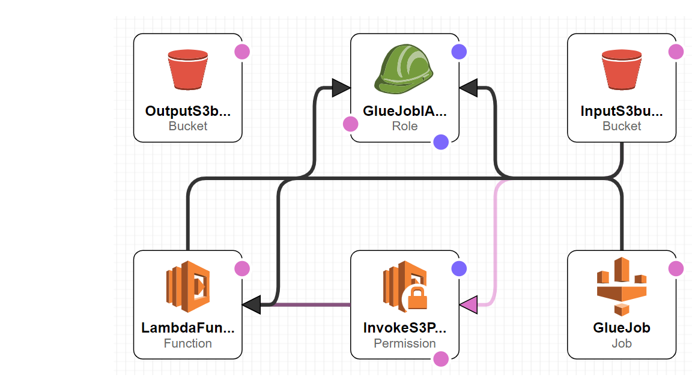

# Adobe_Data_Engineering_Coding_Exercise

This exercise illustrates Python/AWS application that reads hit-level data files as input and helps us understand revenue sources for their products with respect to a search engine and search keywords. This application runs and create infrastructure with AWS Cloudformation and uses lambda and glue AWS services to process input file and give output with a revenue source for their products.

## Prerequisites

1. AWS CLI - Required to perform operations using the local machine.
2. AWS S3 bucket - We need to store files in zip format to load in lambda function and glue job.

## Application Components details

[deployment_template.yml(deployment_template.yml) - AWS Cloudformation template to create AWS infrastructure to run this application (we are creating IAM roles, S3 buckets, Glue Job, Lambda Function, and Permission).

[src/app.py](src/app.py) - Python code to perform ETL (AWS Glue job).

[src/requirements.txt](src/requirements.txt) - Dependencies to run ETL job.

[lambda_function.py](lambda_function.py) - Python code (lambda function) to trigger ETL (AWS glue job).

[lambda.zip](lambda.zip) - Compressed ZIP file containing lambda folder.

## Serverless deployment process flow (created in AWS couldformation - designer)


Conceptual Process Flow
## Serverless deployment process flow (created in AWS couldformation - designer)



Deployment Steps - 

1. Git clone the repository

```bash
https://github.com/SourabhShrivas/Adobe_Data_Engineering_Coding_Exercise
```

2. Upload the lambda function to an S3 bucket

```bash
aws s3 cp lambda.zip s3://s3-adobe-repository/
```

3. Upload the ETL (Glue Job app.py on repository S3 bucket - (s3-adobe-repository)

```bash
aws s3 cp src/app.py s3://s3-adobe-repository/etl/app.py
```

4. Trigger the cloudformation stack with deployment_template.yml template file.

```bash
aws cloudformation deploy --template-file deployment_template.yml --stack-name infrastructure --capabilities CAPABILITY_NAMED_IAM
```

5. Run the process by uploading the input file in the Input S3 bucket (inputs3bucket-adobe). 

```bash
aws s3 cp /Users/soura/Downloads/data.tsv s3://inputs3bucket-adobe/
```

## Deleting the cloudformation stack

Download the output from from s3 bucket (outputs3bucket-adobe) and then empty input and output buckets and delete the cloudformation stack.

1. Empty all the s3 bucket creted by your pipeline

```bash
aws s3 rm s3://inputs3bucket-adobe --recursive
```

```bash
aws s3 rm s3://outputs3bucket-adobe --recursive
```

2. Deleting the stack

```bash
aws cloudformation delete-stack --stack-name infrastructure
```
